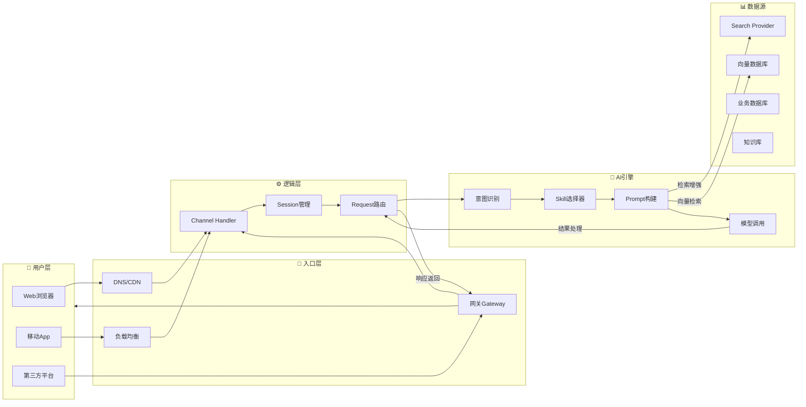
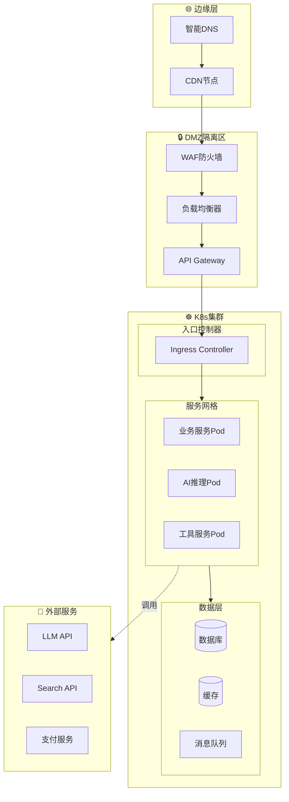

# 基础设施架构图

## 整体架构概览

```mermaid
flowchart TB
    subgraph Legend["📋 图例"]
        direction LR
        L1[🔷 基础设施层]
        L2[🟢 平台软件层]
        L3[🟡 AI/模型层]
        L4[🟣 服务层]
        L5[🟠 接入层]
        L6[🔴 应用层]
    end

    subgraph Infrastructure["🔷 基础设施层 - Infrastructure"]
        direction TB
        subgraph Hardware["🖥️ 硬件资源"]
            direction LR
            H1[🖥️ 物理服务器<br/>Bare Metal]
            H2[☁️ 云服务器<br/>ECS/GCP/Azure]
            H3[📦 容器节点<br/>K8s Nodes]
            H4[💾 存储阵列<br/>NAS/SAN/SSD]
        end

        subgraph Network["🌐 网络基础设施"]
            direction LR
            N1[🔄 负载均衡<br/>LB/SLB]
            N2[🔒 防火墙<br/>Firewall/WAF]
            N3[🌐 CDN<br/>边缘节点]
            N4[🔗 专线/VPN<br/>专用网络]
        end

        subgraph Virtualization["⚙️ 虚拟化层"]
            direction LR
            V1[🐳 Docker<br/>容器运行时]
            V2[☸️ Kubernetes<br/>容器编排]
            V3[🏗️ Istio<br/>服务网格]
            V4[📊 Prometheus<br/>监控集群]
        end
    end

    subgraph SoftwarePlatform["🟢 平台软件层 - Platform"]
        direction TB
        subgraph Database["🗄️ 数据存储"]
            direction LR
            D1[🐘 PostgreSQL<br/>关系型数据库]
            D2[🍃 MongoDB<br/>文档数据库]
            D3[⚡ Redis<br/>缓存/消息队列]
            D4[🔍 Elasticsearch<br/>搜索引擎]
        end

        subgraph Middleware["🔧 中间件"]
            direction LR
            M1[📨 RabbitMQ<br/>消息队列]
            M2[🌊 Kafka<br/>流处理]
            M3[⚙️ etcd<br/>配置中心]
            M4[🔄 Nginx<br/>反向代理]
        end

        subgraph DevOps["🚀 DevOps 工具链"]
            direction LR
            DEV1[🔀 GitLab CI<br/>持续集成]
            DEV2[📦 Harbor<br/>镜像仓库]
            DEV3[📋 ArgoCD<br/>GitOps部署]
            DEV4[🔍 Grafana<br/>可观测性]
        end
    end

    subgraph AIModel["🟡 AI/大模型层 - AI Models"]
        direction TB
        subgraph LLMProviders["🧠 大模型提供商"]
            direction LR
            LLM1[🤖 Claude<br/>Anthropic]
            LLM2[⭐ GPT-4<br/>OpenAI]
            LLM3[🌙 Gemini<br/>Google]
            LLM4[🦙 LLaMA<br/>Meta]
            LLM5[💎 DeepSeek<br/>深度求索]
            LLM6[🔥 Qwen<br/>阿里通义]
        end

        subgraph ModelInfra["⚡ 模型基础设施"]
            direction LR
            MI1[🎮 GPU集群<br/>A100/H100]
            MI2[⚙️ vLLM<br/>推理引擎]
            MI3[🔧 Triton<br/>模型服务]
            MI4[📊 MLflow<br/>模型管理]
        end

        subgraph VectorDB["📐 向量数据库"]
            direction LR
            VDB1[🔍 Pinecone<br/>向量检索]
            VDB2[🐍 Milvus<br/>开源向量DB]
            VDB3[⚡ pgvector<br/>Postgres扩展]
            VDB4[🏠 Weaviate<br/>AI原生向量DB]
        end
    end

    subgraph ServiceLayer["🟣 服务层 - Services"]
        direction TB
        subgraph SearchProviders["🔍 Search Providers"]
            direction LR
            SP1[🌐 Google Search<br/>谷歌搜索API]
            SP2[🔎 Bing Search<br/>必应搜索API]
            SP3[🤝 SerpAPI<br/>聚合搜索]
            SP4[📚 Tavily<br/>AI搜索引擎]
            SP5[🔬 Brave Search<br/>隐私搜索]
            SP6[🏢 Exa/Metaphor<br/>神经网络搜索]
        end

        subgraph APIGateway["🚪 API Gateway"]
            direction LR
            GW1[⚡ Kong<br/>开源网关]
            GW2[☁️ AWS API Gateway]
            GW3[🌐 Nginx Plus<br/>企业网关]
            GW4[🔗 GraphQL<br/>联邦网关]
        end

        subgraph Microservices["🔩 微服务"]
            direction LR
            MS1[👤 用户服务<br/>User Service]
            MS2[🔐 认证服务<br/>Auth Service]
            MS3[💬 对话服务<br/>Chat Service]
            MS4[📄 文档服务<br/>Doc Service]
            MS5[🔔 通知服务<br/>Notification]
        end
    end

    subgraph AccessLayer["🟠 接入层 - Access"]
        direction TB
        subgraph Channels["📱 Channels"]
            direction LR
            CH1[💻 Web端<br/>React/Vue]
            CH2[📱 移动端<br/>iOS/Android]
            CH3[💬 微信生态<br/>小程序/公众号]
            CH4[🤖 Slack<br/>工作区集成]
            CH5[📧 Email<br/>邮件渠道]
            CH6[🔌 WebSocket<br/>实时通信]
        end

        subgraph GatewayLayer["🌉 Gateway"]
            direction LR
            GL1[🛡️ WAF<br/>Web应用防火墙]
            GL2[⚖️ Rate Limiter<br/>限流器]
            GL3[🔑 Auth Gateway<br/>认证网关]
            GL4[📡 WebSocket GW<br/>长连接网关]
        end
    end

    subgraph Application["🔴 应用层 - Applications"]
        direction TB
        subgraph Skills["🎯 Skills"]
            direction LR
            SK1[📝 Code Generation<br/>代码生成]
            SK2[🔍 Code Review<br/>代码审查]
            SK3[🧪 Test Generation<br/>测试生成]
            SK4[📊 Data Analysis<br/>数据分析]
            SK5[🌐 Web Search<br/>网络搜索]
            SK6[📄 Doc Q&A<br/>文档问答]
            SK7[🔧 DevOps<br/>运维技能]
            SK8[🎨 UI Design<br/>设计辅助]
        end

        subgraph Agents["🤖 Agents"]
            direction LR
            AG1[👨‍💻 Coding Agent<br/>编程助手]
            AG2[🔬 Research Agent<br/>研究助手]
            AG3[📈 Analysis Agent<br/>分析助手]
            AG4[🎓 Tutor Agent<br/>教学助手]
        end
    end

    %% 层间连接
    Hardware --> Virtualization
    Virtualization --> SoftwarePlatform
    SoftwarePlatform --> ModelInfra
    ModelInfra --> LLMProviders
    LLMProviders --> APIGateway
    APIGateway --> GatewayLayer
    GatewayLayer --> Skills

    %% 横向连接
    VectorDB -.->|RAG检索| LLMProviders
    SearchProviders -.->|增强知识| LLMProviders
    Channels -.->|用户接入| GatewayLayer
    Microservices -.->|业务支撑| APIGateway
    Agents -.->|调用| Skills

    style Infrastructure fill:#e3f2fd,stroke:#1976d2,stroke-width:3px
    style SoftwarePlatform fill:#e8f5e9,stroke:#388e3c,stroke-width:3px
    style AIModel fill:#fff8e1,stroke:#f57c00,stroke-width:3px
    style ServiceLayer fill:#f3e5f5,stroke:#7b1fa2,stroke-width:3px
    style AccessLayer fill:#fbe9e7,stroke:#e64a19,stroke-width:3px
    style Application fill:#ffebee,stroke:#c62828,stroke-width:3px
    style Legend fill:#fafafa,stroke:#616161,stroke-width:2px
```

---

## 详细架构说明

### 🔷 1. 基础设施层 (Infrastructure Layer)

| 模块 | 技术组件 | 功能描述 |
|------|----------|----------|
| **硬件资源** | 物理服务器、云服务器ECS、GPU集群 | 提供计算、存储、网络基础资源 |
| **网络设施** | 负载均衡SLB、CDN、WAF防火墙、专线VPN | 保障网络访问质量与安全防护 |
| **虚拟化** | Docker、Kubernetes、Istio、Prometheus | 容器化部署、服务编排与监控 |

### 🟢 2. 平台软件层 (Platform Layer)

| 模块 | 技术组件 | 功能描述 |
|------|----------|----------|
| **数据存储** | PostgreSQL、MongoDB、Redis、Elasticsearch | 结构化/非结构化数据持久化与检索 |
| **中间件** | RabbitMQ、Kafka、etcd、Nginx | 消息通信、配置管理、流量转发 |
| **DevOps** | GitLab CI、Harbor、ArgoCD、Grafana | CI/CD流水线、镜像管理、可观测性 |

### 🟡 3. AI/大模型层 (AI Model Layer)

| 模块 | 技术组件 | 功能描述 |
|------|----------|----------|
| **大模型提供商** | Claude、GPT-4、Gemini、LLaMA、DeepSeek、Qwen | 提供基础大语言模型能力 |
| **模型基础设施** | GPU集群、vLLM、Triton、MLflow | 模型推理加速与服务化管理 |
| **向量数据库** | Pinecone、Milvus、pgvector、Weaviate | 向量存储与语义检索（RAG） |

### 🟣 4. 服务层 (Service Layer)

| 模块 | 技术组件 | 功能描述 |
|------|----------|----------|
| **Search Providers** | Google/Bing Search、SerpAPI、Tavily、Brave、Exa | 外部知识检索与增强 |
| **API Gateway** | Kong、AWS API Gateway、Nginx Plus、GraphQL | 统一API入口、协议转换、流量治理 |
| **微服务** | 用户服务、认证服务、对话服务、文档服务 | 业务领域服务拆分与治理 |

### 🟠 5. 接入层 (Access Layer)

| 模块 | 技术组件 | 功能描述 |
|------|----------|----------|
| **Channels** | Web、移动端、微信生态、Slack、Email、WebSocket | 多终端用户接入渠道 |
| **Gateway** | WAF、Rate Limiter、Auth Gateway、WebSocket GW | 安全认证、限流、长连接管理 |

### 🔴 6. 应用层 (Application Layer)

| 模块 | 技术组件 | 功能描述 |
|------|----------|----------|
| **Skills** | 代码生成、代码审查、测试生成、数据分析、搜索、问答 | 可复用的AI能力单元 |
| **Agents** | Coding Agent、Research Agent、Analysis Agent | 自主决策的智能体系统 |

---

## 数据流向图

---

## 部署架构图

---

## 架构特点

1. **分层解耦**：各层职责清晰，通过标准接口通信
2. **模块化设计**：每个模块可独立扩展、升级、替换
3. **多云兼容**：支持公有云、私有云、混合云部署
4. **AI原生**：从底层GPU到上层Skill全面支持AI能力
5. **安全合规**：多层安全防护，满足企业合规要求
